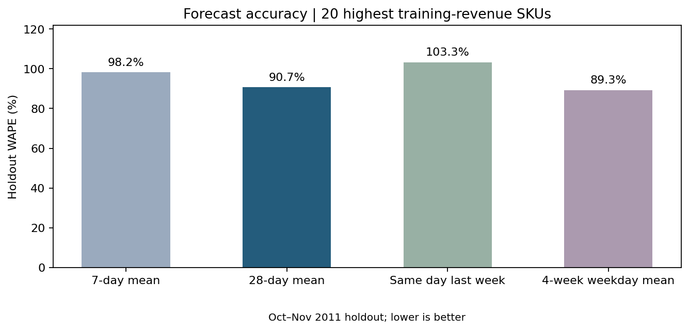
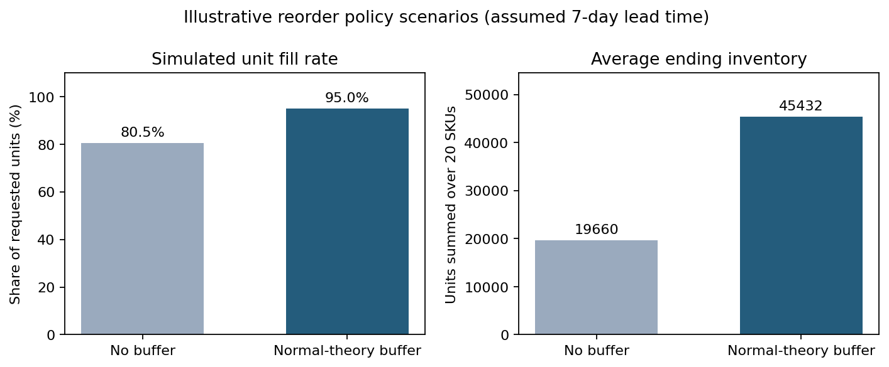
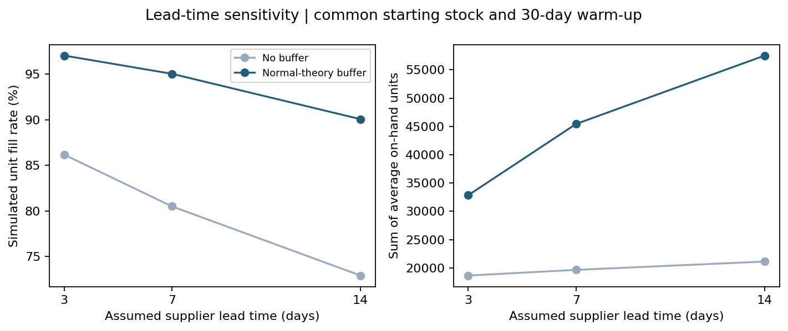

# Retail inventory planning: demand forecasts and reorder policies

An applied supply chain analytics portfolio project using [UCI Online Retail](https://archive.ics.uci.edu/dataset/352/online+retail) transaction records (Chen, 2015; DOI: 10.24432/C5BW33). The dataset is licensed CC BY 4.0. It records sales transactions, **not** the retailer's stock levels, unmet demand, supplier lead times, or purchase costs. All replenishment results below are illustrative simulations and were not implemented at the retailer.

Start with the [guided notebook](Inventory_Project.ipynb) and [2–3 day learning guide](docs/learning_guide.md). The analysis uses Python, Pandas, and NumPy; the results include Excel-compatible CSV tables and a workbook snapshot.

## Business question

For a retailer's high-revenue items, how might an inventory planner use historical sales to select forecasts, order quantities, and reorder points? What changes in a scenario with a statistical safety-stock buffer?

## Results from the provided data

The script read 541,909 original transaction lines and retained 461,385 after limiting the analysis to Jan–Nov 2011, merchandise-like SKU codes, positive quantities and prices, and non-cancelled invoices. It identified 3,709 distinct eligible SKUs across the full analysis window; 3,538 had sales in the Jan–Sep training period and entered the ABC segmentation. SKUs were ranked by **training-period selling revenue**; the top 20 were evaluated on Oct–Nov 2011 (61 days, 1,220 SKU-days).

| Forecast method, using past daily units | MAE, units per SKU-day | WAPE |
|---|---:|---:|
| Prior 7-day moving average | 68.40 | 98.21% |
| Prior 28-day moving average | 63.15 | 90.67% |
| Same weekday last week | 71.95 | 103.31% |
| Mean of the prior four matching weekdays | 62.18 | 89.29% |

The four-week weekday mean had the lowest holdout WAPE among these four prespecified benchmarks, but **all forecasts had high error** for this volatile, seasonal selection. The holdout comparison is descriptive, not independent evidence for a tuned model. A production planning model would need better forecasting and additional data.

| Hypothetical reorder policy | Simulated units filled / requested | Simulated fill rate | Sum of average ending on-hand units across 20 SKUs |
|---|---:|---:|---:|
| Reorder point with no buffer | 68,396 / 84,967 | 80.50% | 19,660 |
| Reorder point with normal-theory buffer | 80,761 / 84,967 | 95.05% | 45,432 |

The buffer produced 12,365 more simulated filled units under the seven-day scenario assumptions, while average inventory was 25,772 units higher. Both policies start with the same stock per SKU and lead-time scenario and run through a 30-day warm-up before measurement. These are **simulated outcomes**, not observed sales gained or verified savings. The label “95%” refers to the normal-theory input quantile, not a guaranteed service level.

| Assumed lead time | No buffer: simulated fill rate | Buffer: simulated fill rate |
|---|---:|---:|
| 3 days | 86.18% | 97.05% |
| 7 days | 80.50% | 95.05% |
| 14 days | 72.90% | 90.07% |

## Reproduce locally or in Google Colab

1. Run `python download_data.py`, or download `Online Retail.xlsx` from the [UCI dataset page](https://archive.ics.uci.edu/dataset/352/online+retail) and place it at `data/Online Retail.xlsx`. The raw dataset is excluded from Git because it is large and available from the source.
2. Install dependencies: `python -m pip install -r requirements.txt`.
3. Run: `python analysis.py` from the repository root. For another location use `python analysis.py --input /path/to/file.xlsx`.
4. Open `Inventory_Project.ipynb` for the guided analysis and plots; in Colab upload `analysis.py`, `report.py`, and the `.xlsx` to the runtime, and adjust the input path in the first code cell.
5. Run `python report.py` to refresh the charts. Inspect the tables in `results/`. The included [Excel workbook](results/inventory_recommendations.xlsx) is a snapshot of this run; import regenerated CSVs into Excel after changing the model. Python does not automatically refresh that workbook.
6. Run `python -m unittest test_logic.py` for the five focused checks covering cleaning, forecast leakage, inventory balance, warm-up accounting, and invalid order quantities.

No credentials or paid software are required. Python may take a minute to read the original spreadsheet.

## Method and decisions

1. Keep transactions dated Jan 1–Nov 30, 2011 with positive quantity and price, invoice numbers without cancellation prefix `C`, and SKU codes matching five digits plus up to two letters. Exclude returns/cancellations instead of silently treating negative quantities as demand. This is an approximation of merchandise sales, and some excluded codes could be legitimate products.
2. Rank all eligible SKUs by Jan–Sep selling revenue and label ABC groups using cumulative selling revenue. This is **not** ABC by inventory value. Select the 20 highest training-revenue SKUs before seeing the test period.
3. Aggregate transactions into daily unit sales and fill absent SKU-days with zero **recorded sales**. Such zeros do not prove there was no demand: a stockout may have suppressed sales.
4. Evaluate previous 7-day and 28-day rolling means, the same weekday last week, and the mean of the four prior matching weekdays on Oct–Nov daily sales. Each estimate uses earlier dates only. MAE and WAPE pool the 1,220 SKU-days; WAPE divides total absolute errors by total observed units. These are rolling one-day-ahead forecasts; they are not seven-day-ahead supplier lead-time forecasts.
5. Estimate inventory policy parameters using Jan–Aug only, then warm up inventory state during September. Keep these policy parameters fixed during measurement. Forecast benchmarking is a separate analysis; the daily forecasts do not feed the replenishment simulation.
6. For each assumed lead time `L` in 3, 7, and 14 days, baseline reorder point is `ceil(mean daily sales × L)`. Buffered point adds `ceil(1.645 × daily standard deviation × sqrt(L))`, relying on independent daily demand and a normal approximation. The daily review approximation is another limitation.
7. Use illustrative EOQ quantities computed from annualized Jan–Aug mean sales, a hypothetical £20/order, estimated purchase price of 60% of the median Jan–Aug selling price, and annual holding cost of 25% of that estimated purchase price. These figures are **assumptions, not retailer data**.
8. For each SKU/lead-time pair, start both policies on September 1 with `baseline reorder point + EOQ` on hand and no pipeline orders. Receive orders at the start of the promised day, lose sales if stock is insufficient, and reorder at day end whenever inventory position reaches the point. Carry stock and pipeline orders through the warm-up; report only Oct–Nov metrics. Test-period observed sales are treated as a demand proxy; actual stockouts and lost demand cannot be measured.

## Recommended next improvements

- Investigate extreme sales spikes and evaluate weekly aggregate forecasts or intermittent-demand methods with an earlier validation period for model selection.
- Obtain actual supplier lead times, on-hand inventory, backorders, and purchase prices before estimating business savings.
- Estimate lead-time forecast errors and compare an empirical buffer with the normal approximation. Connect the forecast and inventory modules only after validating the appropriate horizon.

## Resume wording after you review and understand the work

**Retail Inventory Planning Project | Python, Pandas, Excel**

- Analyzed 461K cleaned retail transaction lines and segmented 3,538 SKUs by training-period revenue; evaluated four demand forecasting benchmarks for the top 20 SKUs on 61 holdout days.
- Built an illustrative EOQ/reorder-point simulation across three assumed lead times, using common starting inventory and a 30-day warm-up to evaluate the inventory/service trade-off of safety stock.

The project and measured counts can be listed once you have run through the code and can explain the assumptions. Do not describe the modeled fill rate as a real operational improvement.
